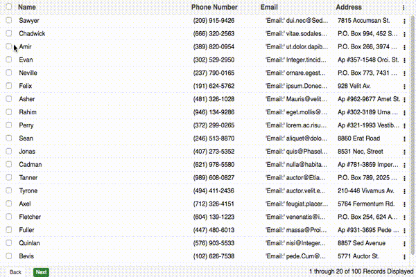

# React-Redux Grid

[](https://badge.fury.io/js/react-redux-grid)
[](https://travis-ci.org/bencripps/react-redux-grid)
[](https://www.versioneye.com/user/projects/571b8782fcd19a0045441c8d)
[]()
[](https://codecov.io/gh/bencripps/react-redux-grid)
[](https://gitter.im/bencripps/react-redux-grid)
[](https://scrutinizer-ci.com/g/bencripps/react-redux-grid/?branch=master)
[](http://isitmaintained.com/project/bencripps/react-redux-grid "Average time to resolve an issue")
[](http://isitmaintained.com/project/bencripps/react-redux-grid "Percentage of issues still open")
[](https://github.com/bencripps/react-redux-grid/blob/master/docs/CONTRIBUTING.MD)

A Grid and Tree Component written in [React](https://facebook.github.io/react) using the [Redux](https://github.com/rackt/redux) Pattern.




[More Examples Available](http://react-redux-grid.herokuapp.com/)

## Features

* Flat List or Tree Structure :heavy_minus_sign: :evergreen_tree:
* Local and/or Remote Data Source
* Local and/or Remote Pagination
* Extensive Column Definitions :muscle:
* Draggable Column Width/Resizing
* Draggable Column Ordering
* Sortable Columns
* Grid Action Menus
* Bulk Action Toolbar
* Selection Model (Single, MultiSelect, Checkbox)
* Event Handling for all kinds of DOM Events (List Below)
* Extendable and Modular Style Built with JavaScript :bowtie:
* Loading Mask
* Built-in Error Handling Module
* Handles Huge amount of Records (1000000+) :star:

## Installation

```bash
$ npm install react-redux-grid --save
```

**Fonts** are not packaged with the grid component, as that's considered bad practice. The grid component utilizes font awesome, and expects it to be available. For more information, see the demo folder, or the FAQ below.

## Usage

````javascript
import React from 'react';
import { render } from 'react-dom';
import { Grid, Store as store } from 'react-redux-grid';

render(
    <Grid
        data={data}
        stateKey={stateKey}
        store={store} // or pass your existing redux store
    />,
    document.getElementById('grid-mount')
);
````

## Grid Level Parameters

| Prop                | Type                    | Description       |
|---------------------|-------------------------|-------------------|
| stateful            | bool                    | the grid will store column configuration in browser local storage (based off of `stateKey`, so the key must be unique across all grids in a single application)|
| height              | int                     | the height of the grid container                                                                                                                               |
| showTreeRootNode    | bool                    | used with tree-grid, to determine if root node should be displayed                                                                                             |
| classNames          | array                   | a list of strings to be applied to the grid container as classes                                                                                               |
| events              | object                  | grid event object, more information below                                                                                                                      |
| store               | object.isRequred        | redux store                                                                                                                                                    |
| reducerKeys         | object                  | object describing custom named reducers, more information below                                                                                                |
| pageSize            | int                     | number of records to shown on a single grid page                                                                                                               |
| emptyDataMessage    | any                     | can be a string or a react component, which will be displayed if no grid data is available                                                                     |
| dragAndDrop         | bool                    | whether drag and drop of rows should be enabled                                                                                                                |
| gridType            | oneOf(['grid', 'tree']) | whether the grid will be a flat list or a tree view                                                                                                            |

## Columns
```javascript
export const columns = [
    {
        name: 'Name',
        dataIndex: 'name',
        editor: '<input type="text" required />',
        width: '10%',
        className: 'additional-class',
        renderer: ({ column, value, row }) => {
               return (
                   <span> Name: { value } </span>
                   );
           },
        hidden: false,
        placeholder: 'Name',
        validator: ({ value, values }) => {
            return value.length > 0;
        },
        change: ({ values }) => {
            return {
                otherColDataIndex: 'newValue'
            };
        },
        disabled: ({ value, values }) => {
            if (value === 'ShouldDisabled') {
                return true;
            }
            return false;
        },
        hideable: false,
        resizable: false,
        moveable: false,
        HANDLE_CLICK: () => { console.log('Header Click'); },
        createKeyFrom: true
    }
];
```

| Prop                | Type                           | Description       |
|---------------------|--------------------------------|-------------------|
| name                | string                         | title of column to be displayed |
| dataIndex           | oneOfType([string, array])     | the key accessor for the column value (required parameter). if data is provided as a complex object, deeply nested data can be accessed by providing an array of keys                |
| editor              | jsx                            | when an editor is used, this element will be rendered in place of the edited cell                                                                                                    |
| width               | int                            | width of column (if none is provided, a default width will be applied)                                                                                                               |
| className           | array                          | additional class names to apply to header of this column                                                                                                                             |
| renderer            | func                           | a function which returns the cell contents for this column                                                                                                                           |
| hidden              | bool                           | whether the column is hidden or visible                                                                                                                                              |
| hideable            | bool                           | whether the column can be hidden                                                                                                                                                     |
| moveable            | bool                           | whether this column can be moved                                                                                                                                                     |
| placeholder         | string                         | the placeholder that will be used for the editor input                                                                                                                               |
| validator           | func                           | a func that should return a boolean, to determine if the newly input value is valid                                                                                                  |
| change              | func                           | a func that should return an object where keys are the dataIndex of affected columns, and the values will be the new values associated with that dataIndex.                          |
| disabled            | oneOfType([func, bool])        | whether the field should be disabled while in edit mode.                                                                                                                             |
| createKeyFrom       | bool                           | see [full documentation on createKeyFrom](docs/CREATE_KEY_FROM.md)                                                                                                                   |
| sortFn              | func                           | when a local sort action occurs, you can provide a method that will be passed to [sort](https://developer.mozilla.org/en-US/docs/Web/JavaScript/Reference/Global_Objects/Array/sort) |

`dataIndex` Example:
```javascript
const data = {
    outer: {
        middle: {
            inner: 'rowValue'
        }
    }
};
```

You can access this data by providing the column the following dataIndex:

```javascript
const column = {
    name: 'Value',
    dataIndex: ['outer', 'middle', 'inner']
};
```

##### Further Information

1. [`renderers` in depth](docs/USING_CUSTOM_RENDERERS.md)
2. [`editors` in depth](docs/USING_CUSTOM_EDITORS.md)

## Editor
```javascript
export const plugins = {
    EDITOR: {
        type: 'inline',
        enabled: true,
        focusOnEdit: true
    }
}
```

| Prop                | Type                           | Description                                                                                                                           |
|---------------------|--------------------------------|---------------------------------------------------------------------------------------------------------------------------------------|
| type                | oneOf(['inline', 'grid'])      | two editors are available by default. in grid mode, all fields are editable. in inline mode, only a single line is editable at a time |
| enabled             | bool                           | if true, the grid will have an editor available                                                                                       |
| focusOnEdit         | bool                           | focus the first editable input when an edit event occurs (defaults to true)                                                           |                                                                                                   |


## Column Manager
```javascript
export const plugins = {
    COLUMN_MANAGER: {
        resizable: false
        defaultColumnWidth: `${100 / columns.length}%`,
        minColumnWidth: 10,
        moveable: true,
        headerActionItemBuilder: () => {},
        sortable: {
            enabled: true,
            method: 'local',
            sortingSource: 'http://url/to/sortingSource'
        }
    }
}
```

| Prop                      | Type                          | Description                                                                                                                                   |
|---------------------------|-------------------------------|-----------------------------------------------------------------------------------------------------------------------------------------------|
| resizable                 | bool                          |  will set all columns to resizable. This parameter will not override columns that have declared they are not resizable from the columns array |
| defaultColumnWidth        | int                           | if no column width is provided, columns will be divided equally. this can be overwritten by providing a new string template                   |
| minColumnWidth            | int                           | the minimum width a column can be dragged to                                                                                                  |
| moveable                  | bool                          | whether the columns can be reordered by drag                                                                                                  |
| headerActionItemBuilder   | func                          | build a custom jsx component to be used as the header action items                                                                            |
| sortable                  | object                        | an object that describes whether columns can be sorted                                                                                        |
| sortable.enabled          | bool                          | an object that describes whether columns can be sorted                                                                                        |
| sortable.method           | oneOf(['local', 'remote'])    | whether sorting will execute locally, or remotely                                                                                             |
| sortable.sortingSource    | string                        | where sorting data will be retrieved (a required parameter for remote sorting)                                                                |

## Pagination
```javascript
export const plugins = {
    PAGER: {
        enabled: true,
        pagingType: 'remote',
        toolbarRenderer: (pageIndex, pageSize, total, currentRecords, recordType) => {
            return `${pageIndex * pageSize} through ${pageIndex * pageSize + currentRecords} of ${total} ${recordType} Displayed`;
        },
        pagerComponent: false
    }
};
```

| Prop                      | Type                          | Description                                                                                                                                   |
|---------------------------|-------------------------------|-----------------------------------------------------------------------------------------------------------------------------------------------|
| enabled                   | bool                          | whether a pager will be used, defaults to true                                                                                                |
| pagingType                | oneOf(['local', 'remote'])    | defaults to `local`                                                                                                                           |
| toolbarRenderer           | func                          | a function which which returns the description of the current pager state, ex: 'Viewing Records 10 of 100'                                    |
| pagerComponent            | jsx                           | if you'd like to pass your own pager in, you can supply a jsx element which will replace the pager entirely                                   |

##### Note about using a Custom Pager

You can pass a `JSX` element to replace the pager entirely. This can be either a connected or unconnected component. To dispatch paging events, you can use the `Actions.PagerActions.setPageIndexAsync` or `Actions.PagerActions.setPage` that are exposed from the main export.

Example:
```javascript
// my custom actionHandler that my custom component uses

export const setPageIndex = (pageIndex, pageSize, dataSource) => {
    return (dispatch) => {
        // dispatch an event that the grid is listening for, which updates the current records
        dispatch(
            Actions.PagerActions
                .setPageIndexAsync(pageIndex, pageSize, dataSource)
        );

        // dispatch an event that my custom toolbar is listening for
        // to update the current pageIndex
        dispatch({
            type: SET_PAGE_INDEX,
            pageIndex
        });

    };
};
```

## Grid Actions (Row Menu Actions)
```javascript
export const plugins = {
    GRID_ACTIONS: {
        iconCls: 'action-icon',
        onMenuShow: ({ columns, rowData }) => {

            console.log('This event fires before menushow');

            if (rowData.isDisabled) {
                return ['menu-item-key'] // this field will now be disabled
            }

        },
        menu: [
            {
                text: 'Menu Item',
                key: 'menu-item-key',
                EVENT_HANDLER: () => {
                    alert('Im a menu Item Action');
                }
            }
        ]
    }
};
```

| Prop                      | Type                          | Description                                                                                                                                   |
|---------------------------|-------------------------------|-----------------------------------------------------------------------------------------------------------------------------------------------|
| iconCls                   | string                        | class to be used for the action icon                                                                                                          |
| menu                      | arrayOf(object)               | menuItems, with `text`, `key`, `EVENT_HANDLER` properties                                                                                     |
| onMenuShow                | func                          | a method that fires upon menu action click. @return an array of `keys` to disable menu items that correspond with these keys.                 |

##### Notes about Menu Items

Each object must contain a unique key relative to it's parent array. These keys will be used as the JSX element key.

## Sticky Header/Footer

If you'd like to disable scrolling within the grid container, in favor of an infinite scroll UI you can use the sticky header/footer feature.
```javascript
export const plugins = {
    STICKY_HEADER: {
        enabled: true,
        scrollTarget: '#my-scrollable-div',
        listener: customFunc
    },
    STICKY_FOOTER: {
        enabled: true,
        scrollTarget: '#my-scrollable-div',
        listener: customFunc
    }
}
```

| Prop                      | Type                          | Description                                                                                                                                   |
|---------------------------|-------------------------------|-----------------------------------------------------------------------------------------------------------------------------------------------|
| enabled                   | bool                          | whether the sticky header is initialized                                                                                                      |
| scrollTarget              | string                        | optional, useds as a selector to find the scrollable parent, ex. '.page-container'                                                            |
| listener                  | func                          | optional, custom function to be called on scroll                                                                                              |

## Selection Model
```javascript
export const plugins = {
    SELECTION_MODEL: {
        mode: 'single',
        enabled: true,
        editEvent: 'singleclick',
        allowDeselect: true,
        activeCls: 'active-class',
        selectionEvent: 'singleclick'
    }
};
```

| Prop                      | Type                                                            | Description |
|---------------------------|-----------------------------------------------------------------|---------------------------------------------------------------------------------------------------------------|
| mode                      | oneOf(['single', 'multi', 'checkbox-single', 'checkbox-multi']) | determines whether a single value, or multiple values can be selected                                         |
| editEvent                 | oneOf(['singleclick', 'doubleclick', 'none'])                  | what type of mouse event will trigger the editor                                                              |
| enabled                   | bool                                                            | whether the selection model class is initialized                                                              |
| allowDeselect             | bool                                                            | whether a value can be deselected                                                                             |
| activeCls                 | string                                                          | the class applied to active rows upon selection                                                               |
| selectionEvent            | oneOf(['singleclick', 'doubleclick'])                           | the browser event which triggers the selection event                                                          |

## Error Handler

```javascript
export const plugins = {
    ERROR_HANDLER: {
        defaultErrorMessage: 'AN ERROR OCURRED',
        enabled: true
    }
};
```

| Prop                      | Type                          | Description                                                                                                                                   |
|---------------------------|-------------------------------|-----------------------------------------------------------------------------------------------------------------------------------------------|
| defaultErrorMessage       | string                        | the default error message to display when no error information is available                                                                   |
| enabled                   | bool                          | whether the error handler should be initialized                                                                                               |

## Loader

```javascript
export const plugins = {
    LOADER: {
        enabled: true
    }
};
```

| Prop                      | Type                          | Description                                                                                                                                   |
|---------------------------|-------------------------------|-----------------------------------------------------------------------------------------------------------------------------------------------|
| enabled                   | bool                          | whether the loading mask should be initialized                                                                                                |

## Bulk Actions

```javascript
export const plugins = {
    BULK_ACTIONS: {
        enabled: true,
        actions: [
            {
                text: 'Bulk Action Button',
                EVENT_HANDLER: () => {
                    console.log('Doing a bulk action');
                }
            }
        ]
    }
};
```

| Prop                      | Type                          | Description                                                                                                                                   |
|---------------------------|-------------------------------|-----------------------------------------------------------------------------------------------------------------------------------------------|
| enabled                   | bool                          | whether the bulk action toolbar should be used                                                                                                |
| actions                   | arrayOf(object)               | the actions (including button text, and event handler) that will be displayed in the bar                                                      |

## Events

All grid events are passed in as a single object.
```javascript
export const events = {
    HANDLE_CELL_CLICK: () => {},
    HANDLE_CELL_DOUBLE_CLICK: () => {},
    HANDLE_BEFORE_ROW_CLICK: () => {},
    HANDLE_ROW_CLICK: () => {},
    HANDLE_ROW_DOUBLE_CLICK: () => {},
    HANDLE_BEFORE_SELECTION: () => {},
    HANDLE_AFTER_SELECTION: () => {},
    HANDLE_BEFORE_INLINE_EDITOR_SAVE: () => {},
    HANDLE_AFTER_INLINE_EDITOR_SAVE: () => {},
    HANDLE_BEFORE_BULKACTION_SHOW: () => {},
    HANDLE_AFTER_BULKACTION_SHOW: () => {},
    HANDLE_BEFORE_SORT: () => {},
    HANLE_BEFORE_EDIT: () => {},
    HANDLE_AFTER_SELECT_ALL: () => {},
    HANDLE_AFTER_DESELECT_ALL: () => {},
    HANDLE_AFTER_ROW_DROP: () => {},
    HANDLE_BEFORE_TREE_CHILD_CREATE: () => {}
};
```

Each function is passed two arguments, the first is a context object which will contain metadata about the event, and the second argument is the browser event if applicable.

````js
HANDLE_CELL_CLICK = ({ row, rowId, rowIndex }, e) => {}
````

## Style

All core components and plugins have corresponding `.styl` files that can be extended or overwritten. Class names have also been modularized and are available to modify or extend within `src/constants/gridConstants.js`

To update `CLASS_NAMES` or the `CSS_PREFIX` dynamically, you can use the `applyGridConfig` function. More information is available [here](docs/USING_GRID_CONFIG.md)

```javascript

export const CSS_PREFIX = 'react-grid';

export const CLASS_NAMES = {
    ACTIVE_CLASS: 'active',
    DRAG_HANDLE: 'drag-handle',
    SORT_HANDLE: 'sort-handle',
    SECONDARY_CLASS: 'secondary',
    CONTAINER: 'container',
    TABLE: 'table',
    HEADER: 'header',
    ROW: 'row',
    CELL: 'cell',
    PAGERTOOLBAR: 'pager-toolbar',
    EMPTY_ROW: 'empty-row',
    LOADING_BAR: 'loading-bar',
    DRAGGABLE_COLUMN: 'draggable-column',
    COLUMN: 'column',
    SORT_HANDLE_VISIBLE: 'sort-handle-visible',
    BUTTONS: {
        PAGER: 'page-buttons'
    },
    SELECTION_MODEL: {
        CHECKBOX: 'checkbox',
        CHECKBOX_CONTAINER: 'checkbox-container'
    },
    ERROR_HANDLER: {
        CONTAINER: 'error-container',
        MESSAGE: 'error-message'
    },
    EDITOR: {
        INLINE: {
            CONTAINER: 'inline-editor',
            SHOWN: 'shown',
            HIDDEN: 'hidden',
            SAVE_BUTTON: 'save-button',
            CANCEL_BUTTON: 'cancel-button',
            BUTTON_CONTAINER: 'button-container'
        }
    },
    GRID_ACTIONS: {
        CONTAINER: 'action-container',
        SELECTED_CLASS: 'action-menu-selected',
        MENU: {
            CONTAINER: 'action-menu-container',
            ITEM: 'action-menu-item'
        }
    },
    BULK_ACTIONS: {
        CONTAINER: 'bulkaction-container',
        DESCRIPTION: 'bulkaction-description',
        SHOWN: 'shown',
        HIDDEN: 'hidden'
    }

};
```

## FAQ

## Creating a Tree Grid

For more information abot creating a tree grid, please see [tree grid in depth](docs/USING_TREE.md)

## Which Store do I use?

Because Redux imposes a single store pattern, it's very probable that you will need to use this grid with your own store. Well that's ok! The `demo` folder includes:

1. `index.html`
2. `entry.js` The entry point for webpack to build all required assets
3. `provider.jsx` The Redux entry point, where your store will be declared

This component will work out of the box, without installing a custom store. A store has been created within the components source files, but this store will be entirely ignored if a different store is passed to the grid.

In the demo `provider.jsx`, we are simply passing the store at path`'../src/store/store';`. To use your own store, simply provide your own store (recommended) or overwrite the source store.

If you elect to use a custom store, the core component's reducers are also exposed from within the core export. You can import a reducer like so:

```javascript
import { Reducers as gridReducers } from 'react-redux-grid';

const rootReducer = combineReducers({
    ...gridReducers,
    yourCustomReducer
};
```

For more information about importing `Reducers`, check out [grid reducers in depth](docs/USING_GRID_REDUCERS.md)

## What's a `stateKey`?

A `stateKey` is a unique ID associated with each grid instantiation, and is a required parameter. Because all grid data is stored in a `reducer`, we need a unique key to access each grid's subsection of data in these objects. If a grid is instantiated without a `stateKey`, it will will throw a user error in the console. If a duplicate `stateKey` is passed to grid it will throw a user error in the console. In short, please provide a unique `stateKey` to each grid you create.

## Data

Data can be provided to a grid in two ways.

1. As a Local Data Source (in memory)
2. As a Remote Data Source, via AJAX (by providing a route, or a function which returns a `Promise`)

If data is provided as a local variable it should be described as an array of objects, and declared using `data = [];`.

If data is provided as a request route, it should be described as a string or a function and declared using `dataSource = path/to/data/source;`.

If data is provided as a function, it should return a `Promise`


Examples of both cases:

### Local

```javascript
const data = [
    {
        name: 'Michael Jordan',
        position: 'Shooting Guard'
    },
    {
        name: 'Charles Barkley',
        position: 'Power Forward'
    }, ...
];

const grid = <Grid data={ data } />
```

### Remote -- as a string

```javascript
const dataSource = 'route/to/your/data/source';
const grid = <Grid dataSource={ dataSource } />
```

### Remote -- as a function which returns a promise

```javascript
const dataSource = () => {

    return new Promise((success) =>{

        return $.get({
            method: 'GET',
            route: '/route/to/your/data',
        }).then((response) => {

            // important to note, that the grid expects a data attribute
            // on the response object!

            const gridResponse = {
                data: response.items,
                success: true
            };

            success(gridResponse);
        });

    });
};

const grid = <Grid dataSource= { dataSource } />
 ```


#### What if I want to use my own store, but I want to name the reducer keys myself?

This is possible. You simply need to pass the reducer name as a `prop`.
```javascript
const gridProps = {
    reducerKeys: {
        grid: 'YOUR_GRID_REDUCER_KEY'
    },
    store
};

const grid = <Grid { ...gridProps } />;
```

#### I see fonts aren't included in the package. Do I have to build them with my webpack? Do I have to use them at all?

The grid expects FontAwesome to be available. The grid component doesn't ship with fonts since that's a bad practice. For the grid to work correcrly, you will need to make FontAwesome available either via build process, or linking to them externally.

Please see font awesome's documentation for more [information](http://fontawesome.io/)
